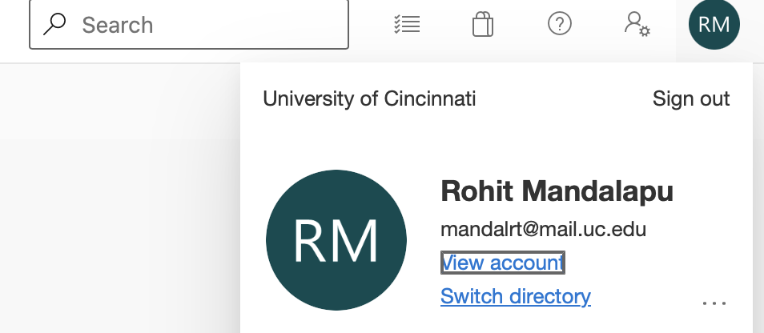

---
lab:
    title: 'Setup lab environment'
    module: 'Module 0: Orientation and Welcome'
---

# Setup lab environment

# Student lab manual

## Instructions

1. Open a browser and navigate to [https://DevOps.azure.com](https://DevOps.azure.com), then then select Login, ther use your UC credentials to login.

1. Verify your organization it should be **University of Cincinnati** as shown in the below screenshot or select the **Switch Organization** and switch to **University of Cincinnati**

    

1. Next, click on the link labelled **My Azure DevOps Organizations** or navigate directly to [https://aex.dev.azure.com](https://aex.dev.azure.com).

1. On the **We need a few more details** page, select **Continue**.

1. In the drop-down box on the left, choose **Default Directory**, instead of “Microsoft Account”.

1. If prompted (*"We need a few more details"*), provide your name, e-mail address, and location and click **Continue**.

1. Back at [https://aex.dev.azure.com](https://aex.dev.azure.com) with **Default Directory** selected click the blue button **Create new organization**.
1. Accept the *Terms of Service* by clicking **Continue**.
1. If prompted (*"Almost done"*), leave the name for the Azure DevOps organization at default (it needs to be a globally unique name) and pick a hosting location close to you from the list.
1. Once the newly created organization opens in **Azure DevOps**, click **Organization settings** in the bottom left corner.
1. At the **Organization settings** screen click **Billing** (opening this screen takes a few seconds).
1. Click **Setup billing** and on the right-hand side of the screen select the **Azure Pass - Sponsorship** subscription and click **Save** to link the subscription with the organization.
1. Once the screen shows the linked Azure Subscription ID at the top, change the number of **Paid parallel jobs** for **MS Hosted CI/CD** from 0 to **1**. Then click the **SAVE** button at the bottom.
1. In **Organization Settings**, go to section **Security** and click **Policies**.
1. Toggle the switch to **On** for **Third-party application access via OAuth**
    > Note: The OAuth setting helps enable tools such as the DemoDevOpsGenerator to register extensions. Without this, several labs may fail due to a lack of the required extensions.
1. Toggle the switch to **On** for **Allow public projects**
    > Note: Extensions used in some labs might require a public project to allow using the free version.
1. **Wait at least 3 hours before using the CI/CD capabilities** so that the new settings are reflected in the backend. Otherwise, you will still see the message *"No hosted parallelism has been purchased or granted"*.
